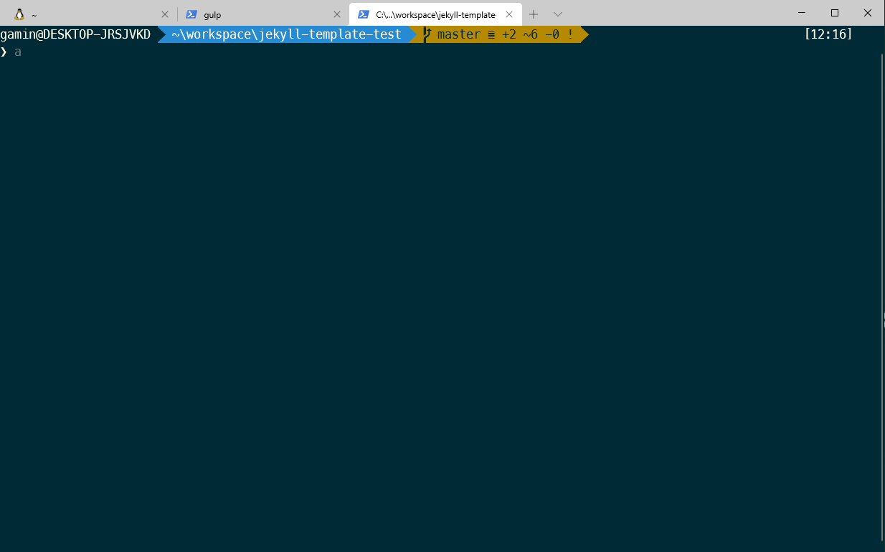

So wieder mal an was neues wagen. Diese Seite hier habe ich mit Gatsby gebaut. Gatsby ist cool, neu und fresh. Zudem ist Gatsby mega modular und hat GraphQL integriert. Aber es gibt auch noch andere Static Site Generatoren.

Github Pages scheint eine super Integration mit Jekyll zu haben. Deswegen wird das auch direkt ausprobiert. 

## Warum auf einmal Githup Pages?
Aufgrund der bedüftigen Situation als Student hat Github erwärmenderweise unglaublich viele Angebote, um uns arme Schlucker zu unterstüzen und zu fördern. Darunter fällt z.B. Github Pro, eine free Namespace Domain mit Github Pages support und vieles vieles mehr. Ein Kumpel hat mich auf auf dieses Angebot aufmerksam gemacht. Und wie heißt es so schön: * Einem geschenkten Gaul, guckt man nicht ins Maul*

Zuerst habe ich mir ein kurzes Intro Video angeschaut, um einen Überblick zu gewinnen. [Link zum Jekyll und Github Pages Tutorial](https://www.youtube.com/watch?v=SWVjQsvQocA)

## Entwicklungsumgebung einrichten 

Neue Tools bedeutet zwangsläufig etwas kopfschmerzen. Das Einrichten ist meiner Erfahrung nach oft eine rumprobieren und nachbessern von Configs etc.

Ich hab mir direkt mal ein Jekyll Template geforkt. Die Orderstruktur, sowie Quality of Life (QoL) Tools sind dabei. 
[Jekyll Template Repository auf Github von dem User Longpdo](https://github.com/longpdo/blank-jekyll-template)

Die QoL Tools umfassen Gulp, BrowserSync, Autoprefixer und SASS 

[Gulp](https://gulpjs.com/) automatisiert den Bau und Entwicklungsprozess von Webentwicklung.

[BrowserSync](https://www.browsersync.io/) dient aktuell nur zum servieren der Seite.

[Autoprefixer](https://github.com/postcss/autoprefixer) fügt der CSS Datei Vendor prefixes hinzu. Good Practice i guess.

Ich hab mich entschlossen auf Windows zu entwickeln. Dazu erstmal PowerShell verschönern. Echt schrecklich das Ding anzuschauen, ohne das daran was gemacht wird. Glücklicherweise waren Fonts und Themen schon wegen WSL installiert. Musste also nur die Config anpassen.

**Verschönerte Powershell**


Hab im Repository also erstmal ```npm install``` eingegeben. **Wups!** Kein Node installiert... Das heißt erstmal Node, Ruby, etc. installieren. Mit Ruby hatte ich damals schlechte Erfahrung gemacht. Fand die Versionen von Gems, Ruby-Versionen und der Gemfile generell schwieriger zu verwalten, als Node und Package.json. Aber naja... da muss ich jetzt durch.

Glücklicherweise hat das installieren fast schmerzfrei geklappt. Alles ist installiert. Als nächstes mehr dependencies installieren also: ``` bundle ``` für die Gems. Zu dem Zeitpunkt habe ich schon die ersten Fehler mit Dependencies bekommen. Erstmal die gemfile.lock umbenannt und ```bundle clean --force``` ausgeführt. Glücklicherweise hat es das Dependencie Problem gelöst.

Mit Gulp also den Development Workflow starten. Das Tool geht seine Tasks durch... der erste klappt... der zweite... und wirft einen Fehler.

Die Funktion **jekyllDev** macht Probleme. Schauen wir sie uns mal an.

```
/**
 * Build Jekyll site
 */
function jekyllDev(done) {
  return cp
    .spawn(
      "bundle",
      ["exec", "jekyll", "build", "--incremental", "--config=_config.yml"],
      {
        stdio: "inherit",
      }
    )
    .on("close", done);
}
```

Folgender Fehler wird geworfen.

```
Unhandled rejection Error: spawn ENOENT
    at errnoException (child_process.js:980:11)
    at Process.ChildProcess._handle.onexit (child_process.js:771:34)
```

Die Funktion ist also für das Generieren der Seite verantwortlich und hat Probleme mit spawn. Btw ENOENT bedeutet für Normalsterbliche *Error NO ENTry* Kein Directory oder ähnliches also. Kann ich nicht viel mit anfangen. Nachgooglen und fündig werden. Die genutzte Funktion cp.spawn funktioniert nicht. cp ist in dem Fall der import child_process.js. Scheint ein Plattform problem zu sein und man solle doch cross_spawn nutzen. Gesagt getan.
* cp import gelöscht
* cp an den Stellen gelöscht, an den es genutzt wurde.
* folgenden Code eingefügt, der die spawn funktion ersetzt.
```
const spawn = require('cross-spawn');
```

Und siehe da: Das gulp script funktioniert und die Seite wird erfolgreich serviert.

**Jekyll Blank Website**


Die Seite ist also schonmal einsatzbereit. Der nächste Schritt ist, dass ganze auf der github page zu veröffentlichen. Dafür dann Part 2.