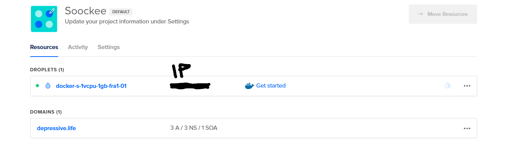

Die Tage habe ich einen Rocketchat Server aufgesetzt. Gedacht ist es dafür eine sicheren Kommunikationskanal für ein potentielles Resource War Development Team bereit zu haben.
Glücklicherweise hatte ich noch eine Domain rumfliegen. Das Zuhause des Chats ist demententsprechend [depressive.life](https://depressive.life). Der Link hat tatsächlich auch ne Backstory. RIP Reckful.

Jedenfalls wollte beschreibe ich mal wie das ganze deployed ist. Durch das Github Education Packet gab es 50€ Digitial Ocean Guthaben geschenkt. Ein sog. Droplet kostet 5€ im Monat. Sollte dementsprechend eine Weile reichen.


Grob zusammengefasst.

1) VM hochfahren
2) Domain und Host zusammenbringen
3) NGINX installieren und konfigurieren.
4) Rocketchat deployen
5) HTTPS aktivieren via Letsencrypt

## VM Hochfahren

Digital Ocean fordert, trotz des Studieangebots, dass man 5€ reinhaut und entweder Kreditkarte oder Paypal verlinkt. AWS macht das glücklicherweiße anders. Anschließend bekommt wird man aufgefordert, ein sog. Droplet hochzufahren. Dazu soll man ein Image auswählen. Das Image bestimmt, welches Betriebssystem und eventuelle Software darauf installiert ist.
Die Auswahl die für mich in Frage kam, war Ubuntu und das Ubuntu Docker Image. Ich hab natürlich das Letztere genommen. Daduch ein bisschen Provisioning Arbeit gespart. 

Das hochgefahrene Droplet sind in dem hübschen Kontrollzenter nun so aus:

**Droplet in DC**



## Domain und Host

Mittlerweile geht das flockig von der Hand. Auf die Domainverwalung des Registrar gehen (in dem Fall Namecheap) und die Nameserver umstellen. Digital Ocean hat drei Nameserver, die für die Domains genutzt werden.
* ns1.digitalocean.com.
* ns2.digitalocean.com.
* ns2.digitalocean.com.

Der Prozess des Nameserverumstellens dauert meiner Erfahrung nach ne ganze Weile. Also erstmal ne Stunde Pause gemacht. Nachdem die Domain über die Digital Ocean Nameserver aufgelöst wurde, kann es ans Konfigurieren gehn. 
Angelegt werden 2 **A Records**
* Der erste A Record verlinkt die Domain mit der IP-Adresse der Maschine. 
* Die zweite verlinkt die Subdomain *www* auf die IP-Adresse der Maschine

Nun kann man die Maschine über die Domain anpingen und schauen, ob das ganze geklappt hat.

**DNS Records in DC**


## NGINX installieren und konfigurieren

Das ist für mich noch der absolut kiffligste Teil. Die NGINX Konfiguration, welche Datei wo hin kommt, default.conf oder site-available, Serverblocks, HTTP und HTTPS. 
Alles Topics von denen man am Anfang echt Alpträume bekommt.

Anfänglich habe ich nur HTTP konfiguriert. Der zweite Schritt war *self-signed certificates*. Diese erlauben es einem HTTPS anzumachen, allerdings ohne Sicherheit. Müsste mich auch mal informieren, was der Unterschied zwischen self-signed und letsencrypt ist. 

So also die initiale Konfiguration. Alles was an HTTP rein kommt, wird erstmal auf 443 umgeleitet. Anschließend wird durch dem proxy_pass ein Kommunikationskanal zu der Anwendung hergestellt, die auf Port 3000 läuft. 

Damit ist schonmal ein HTTPS gegeben. Aber das der Browser sich beschwert, wenn er die URL öffnet ist nicht schön. Deswegen also mit Letsencrypt ein richtiges Zertifikat anschaffen.

```
# https Server
#
#
  server {
        listen 80;
        server_name _;
        if ($http_x_forwarded_proto != 'https') {
        return 301 https://$host$request_uri;
        }
  }
  server {
        listen 443 ssl;
        server_name depressive.life;

        error_log /var/log/nginx/rocketchat_error.log;
        ssl_dhparam /etc/nginx/dhparams.pem;
        ssl_protocols TLSv1.2;
        ssl_ciphers 'ECDHE-RSA-AES128-GCM-SHA256:ECDHE-ECDSA-AES128-GCM-SHA256:ECDHE-RSA-AES256-GCM-SHA384:ECDHE-ECDSA-AES256-GCM-SHA384:DHE-RSA-AES128-GCM-SHA256:DHE-DSS-AES128-GCM-SHA256:kEDH+AESGCM:ECDHE-RSA-AES128-SHA256:ECDHE-ECDSA-AES128-SHA256:ECDHE-RSA-AES128-SHA:ECDHE-ECDSA-AES128-SHA:ECDHE-RSA-AES256-SHA384:ECDHE-ECDSA-AES256-SHA384:ECDHE-RSA-AES256-SHA:ECDHE-ECDSA-AES256-SHA:DHE-RSA-AES128-SHA256:DHE-RSA-AES128-SHA:DHE-DSS-AES128-SHA256:DHE-RSA-AES256-SHA256:DHE-DSS-AES256-SHA:DHE-RSA-AES256-SHA:AES128-GCM-SHA256:AES256-GCM-SHA384:AES128-SHA256:AES256-SHA256:AES128-SHA:AES256-SHA:AES:CAMELLIA:DES-CBC3-SHA:!aNULL:!eNULL:!EXPORT:!DES:!RC4:!MD5:!PSK:!aECDH:!EDH-DSS-DES-CBC3-SHA:!EDH-RSA-DES-CBC3-SHA:!KRB5-DES-CBC3-SHA';
        ssl_prefer_server_ciphers on;
        ssl_session_cache shared:SSL:20m;
        ssl_session_timeout 180m;

        location / {
            proxy_pass http://depressive.life:3000/;
            proxy_http_version 1.1;
            proxy_set_header Upgrade $http_upgrade;
            proxy_set_header Connection "upgrade";
            proxy_set_header Host $http_host;
            proxy_set_header X-Real-IP $remote_addr;
            proxy_set_header X-Forwarded-For $proxy_add_x_forwarded_for;
            proxy_set_header X-Forwarded-Proto https;
            proxy_set_header X-Nginx-Proxy true;
            proxy_redirect off;
        }

}
```


## Rocketchat deployen

[Rocketchat](https://rocket.chat/) bietet glücklicherweise eine schöne Docker-Compose Vorlage. Ich hab [Zulip](https://zulipchat.com/) und [Mattermost](https://mattermost.com/) ausprobiert. Allerdings hat mir das Konfigurieren keinen Spaß gemacht und ich bin zurück zu Rocketchat. Funktioniert noch immer am simpelsten und für die Ansprüche reicht es.

Das bedeutet wir haben die docker-compose.yml und starten den ganzen Spaß direkt mit ```docker-compose up```. 


```
version: '2'

services:
  rocketchat:
    image: rocketchat/rocket.chat:latest
    command: >
      bash -c
        "for i in `seq 1 30`; do
          node main.js &&
          s=$$? && break || s=$$?;
          echo \"Tried $$i times. Waiting 5 secs...\";
          sleep 5;
        done; (exit $$s)"
    restart: unless-stopped
    volumes:
      - ./uploads:/app/uploads
    environment:
      - PORT=3000
      - ROOT_URL=http://depressive.life:3000
      - MONGO_URL=mongodb://mongo:27017/rocketchat
      - MONGO_OPLOG_URL=mongodb://mongo:27017/local
      - MAIL_URL=smtp://smtp.email
#       - HTTP_PROXY=http://proxy.domain.com
#       - HTTPS_PROXY=http://proxy.domain.com
    depends_on:
      - mongo
    ports:
      - 3000:3000
    labels:
      - "traefik.backend=rocketchat"
      - "traefik.frontend.rule=Host: depressive.tld" # is this even a thing? idk 

  mongo:
    image: mongo:4.0
    restart: unless-stopped
    volumes:
     - ./data/db:/data/db
     #- ./data/dump:/dump
    command: mongod --smallfiles --oplogSize 128 --replSet rs0 --storageEngine=mmapv1
    labels:
      - "traefik.enable=false"

  # this container's job is just run the command to initialize the replica set.
  # it will run the command and remove himself (it will not stay running)
  mongo-init-replica:
    image: mongo:4.0
    command: >
      bash -c
        "for i in `seq 1 30`; do
          mongo mongo/rocketchat --eval \"
            rs.initiate({
              _id: 'rs0',
              members: [ { _id: 0, host: 'localhost:27017' } ]})\" &&
          s=$$? && break || s=$$?;
          echo \"Tried $$i times. Waiting 5 secs...\";
          sleep 5;
        done; (exit $$s)"
    depends_on:
      - mongo

  ```

## HTTPS aktivieren via Letsencrypt

Der letzte Schritt. Das hatte ich mir so viel schwerer vorgestellt, aber der Prozess ist wirklich extrem gut. Das ganze hat man dann noch als Ansible Playbook.  Also voll automatisiert. LetsEncrypt und Certbot installieren und anschließend im non-interactive modus arbeiten lassen.

Ich ruf die Domain auf und **bäm** es funktioniert alles auf Anhieb. Selten sowas.

```
# roles/letsencrypt/tasks/main.yml
---
- name: Update and upgrade apt packages
  apt:
    upgrade: "yes"
    update_cache: yes
    cache_valid_time: 86400 #One day

#- name: install lets Encrypt Repository
#  command: |
#    curl -o- https://raw.githubusercontent.com/vinyll/certbot-install/master/install.sh | bash

- name: obtaining SSL Cert
  command: |
    certbot --non-interactive --agree-tos --nginx -m <insert email> -d depressive.life -d www.depressive.life
```

Das war der ganze Prozess für Rocketchat :)

Die ganzen Scripte etc. sind noch auf dem Github Repo zu finden.

[rocketchat repo](https://github.com/Soockee/rocketchat.resource.me)