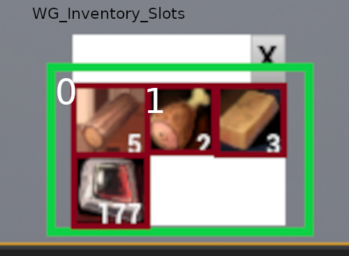
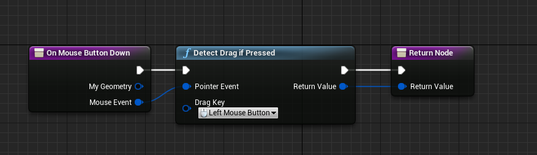
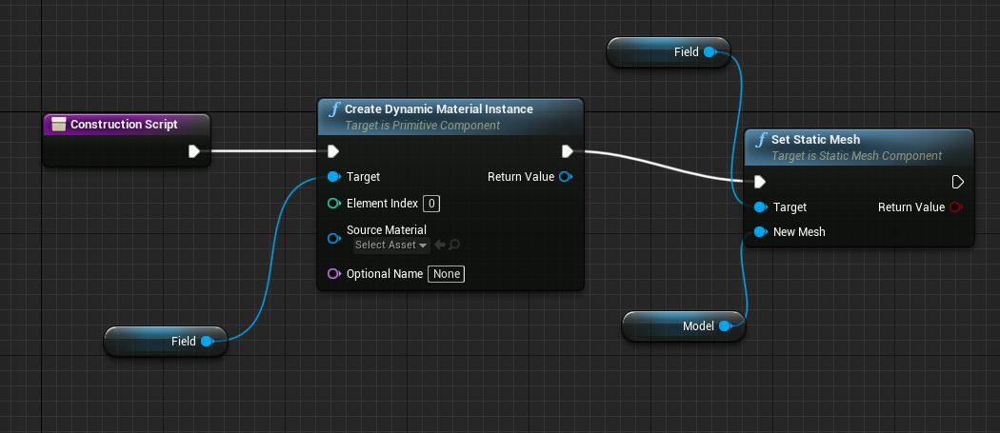
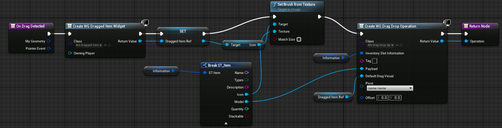
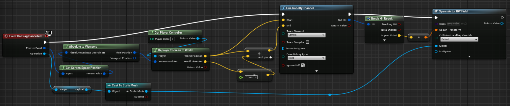
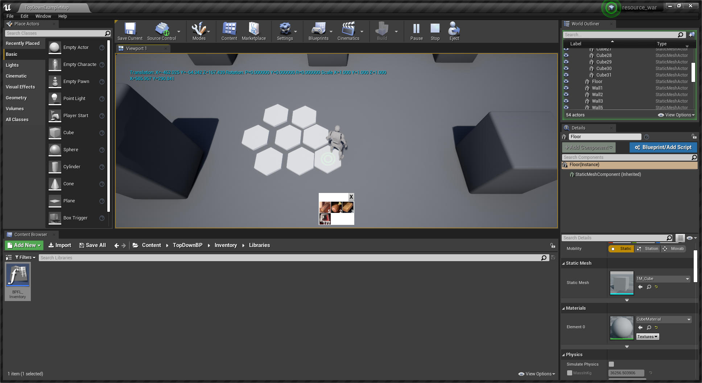

# Drag & Drop von Inventory Items

In diesem Posts wird es um das Platzieren von Items aus dem Inventar in die Welt gehen.

## WG\_Inventory\_Slots
Das Inventory hat vom Layout her folgenden Aufbau. Ein MainContainer, welches alle Widgets enthält. Das sind zum einen die Headerelemene, welches aktuell aus einem Headertext und einem X-Button besteht. Glücklicherweise bin ich für den Post nochmal durch die Elemente gegangen und habe festgestellt, das der Headertext, wie im Screenshot, nicht zu sehen ist. Weiße Schriftfarbe auf Weißem Hintergrund kann schon mal zu Irritationen führen :D

Der Slotspanel ist ist seiner initialen Zustand nicht mit slots befüllt. Bei der Erstellung der Welt werden diese Slots aus einer DataTable generiert.

Das Verhalten bis dahin ist nicht wirklich interaktiv. Die Icons werden gesetzt und die Slots enthalten Zusatzinformationen, die aus der DataTable mitgegeben worden sind. Sonst passiert da nichts.

Die Idee ist jetzt die Slots mit der linken Maustaste zu drücken, die Maustaste gedrückt zu halten, mit der Maus in die Spielwelt zu gehen und beim loslassen der Maustase, ein Objekt zu platzieren. Während die Maus gedrückt ist aka. **drag**, soll das Icon am Mauszeiger mitgezogen werden.

**Layout des Inventorys**



Damit das ganze Umgesetzt werden kann, müssen zwei Funktionen überschrieben und ein Event Hinzugefügt werden.

### OnMouseButtonDown

Die OnMouseButtonDown funktion wird ausgelöst, sobald das Widget mit einem angegebenen Tastendruck betätigt wird. Die Funktion beinhaltet die Detect Drag If Pressed funktion. Bei einem Linken Mausklick, wird also eine weitere Funktion ausgelöst. Diese Funktion ist die **OnDragDetected** Funktion.



## RW\_Field

Das Initialisierungsscript des RW\_Field Actors enthält das Erstellen einer dynamischen Material Instanz für die Field Variable vom Typ Static Mesh Object Reference. Die Static Mesh wird anschließend mit dem Inhalt der Model Variable überschrieben.



### OnDragDetected

Die OnDragDetected wird laut Doku ausgelöst, sobald Slate entdeckt, dass ein Widget gezogen wird. 

```
Slate is the name for Unreal's custom UI programming framework. The editor interface is largely built using Slate. 
```

Es wird ein neues Widget der Klasse WG\_Dragged\_Item erstellt. Das dient später eventuell dazu, die Darstellung beim Drag anzupassen. Aktuell ist WG\_Dragged\_Item ein Widget bestehend aus einem Icon, welcher von dem WG\_Inventory\_Slot übernommen wird. Anschließend wird eine Drag & Drop Operation ausgeführt. In diesem Fall ist es eine Custom Drag & Drop Operation. Diese Cutstom Operation, weicht vom Original nur bei *Inventory Slot Information* ab, die der Custom als Variable hinzugefügt wurde und genutzt werden kann. Anschließend wird die Operation zurückgegeben und entsprechend gefeuert, sobald drag erkannt ist.



Das Spannende passiert, wenn man das gezogene Item loslässt. Dabei wird das **On Drag Cancelled** Event gefeuert. Das Ziel ist es, an der Position der Maus, an der das Item losgelasse wurde, ein Object in die Welt zu setzten. Durch das Pointerevent, welches die Informationen des Zeiger während des Events beinhaltet, kann eine Projezierung der X-Y Koordinaten, die vorher auf den Viewport angepasst wurden, auf die X-Y-Z Welt Koordinaten durchgeführt werden. Somit erhalten wir einen Punkt in der Welt, die unseren gewünschte Position wiederspiegelt. An dieser Stelle macht man ein bisschen Vektor-Magic, d.h. verlängert den World Direction Vektor, addiert ihn mit der Position und erhält einen Endpunkt. Diese beiden Punkte werden für einen **LineTraceByChannel** verwendet. Diese Funktion ermittelt einen Kollisionspunkt mithilfe des Starts und Endvektors, die eine Linie abbilden. Wenn diese Linie mit einem Weltobjekt kollidiert, wird ein sinnvoller Hit Result erzeugt. Die Position des Impact Points wird als Spawnpunkt für einen neuen Actor genutzt. In unserem Fall das generische RW\_Field Object. Das RW\_Field Objekt bekommt  bei der Gelegenheit ein StaticMesh mitgegeben. 
 


Als Ergebnisse erhalten wird die Möglichkeit, per drag and drop Items in die Welt zu setzte, deren Model dynamisch aus der DataTable gelesen wurden. Allerdings unterscheiden sich die Modelle aktuell nicht ... pt. 5 wird das wohl ändern müssen. :D


