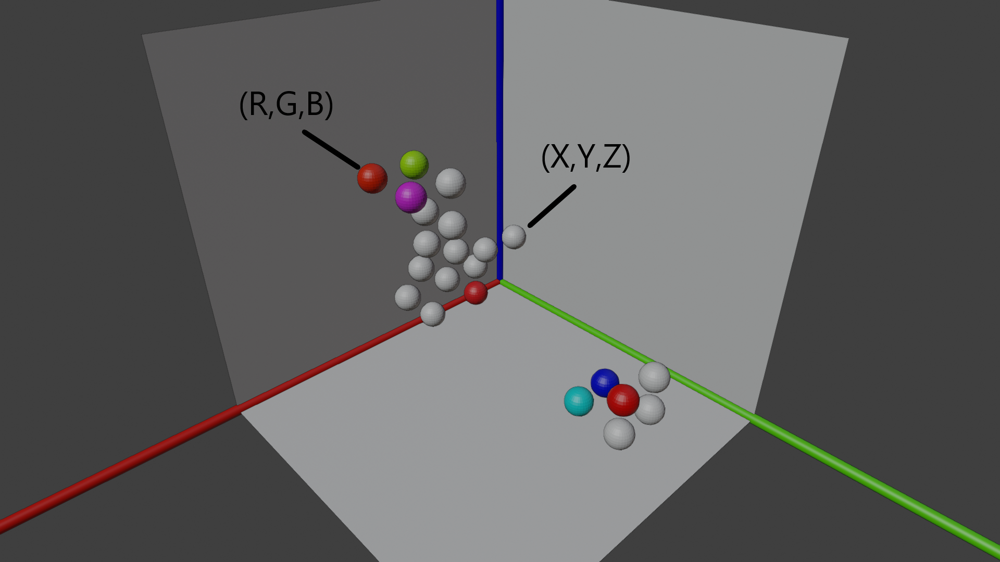
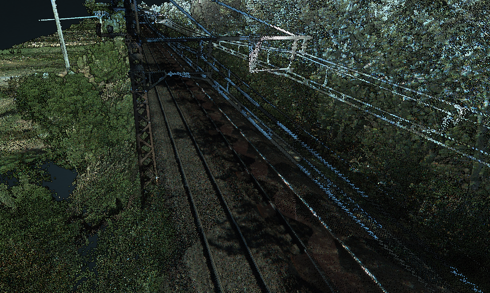

# Absolute Basics

## Was ist eine Punktwolke?
Eine Punktwolke ist eine Sammlung von Daten. Diese Daten sind Punkte. Viele Millionen, Milliarden oder gar Billionen Punkte machen eine Punktwolke aus. Punkte in einer Punktwolke bestehen in ihrer einfachsten Form aus einer Position. Diese Position wird als X,Y,Z Koordiante. Zusätzlich können Metadaten sog. Attribute beigefügt werden. Zum Beispiel die Farbe eines Punktes, die häufig als RGB Wert dargestellt wird. Auch andere Attribute sind vorstellbar.
Aufgrund dessen, dass Punktwolke so massiv viele Punkte beinhalten können, sind die Daten mit denen umgegangen werden muss, sehr groß. Das reicht von kleinen Punktwolken ( 30-80 MB), mittelgroßen (500 MB - 4 GB)  bis hin zu extrem großen Punktwolken (1TB ++ ). Die Werte haben keinen wissenschaftlichen Hintergrund, sondern sollen ein Gefühl für die möglichen Größenordnungen von Punkwolken vermitteln.

**Veranschaulichung von Punkten einer kleinen Punktwolke in einem dreidimensionalen Raum mit RBG und Positionswerten**

## Woher kommen die Daten?
Da Punktwolken aus vielen Punkten bestehen, muss der Ursprung der Punkte erläutert werden. Die Punkte werden durch Laser Scanner oder Photogrammetry erzeugt.

Laser Scanner senden Laser, die von Objekten reflektiert werden. Eine Reflektion wird aufgefangen, falls der Laser auf ein Objekt trifft. Der reflektierte Laser hat sich durch verschiedene Faktoren verändert. Das naheliegenste ist die Distanz, die der Laser zurückgelegt hat. Abhängig von der Distanz kann die Position des Punktes bestimmt werden.

Photogrammetry ist ein Prozess der Bildverarbeitung. Ein Objekt, welches aus einer oder mehrerer Perspektiven erfasst wurde, kann durch diesen Prozess in ein digitales Modell verarbeitet werden.

## Wofür werden Punktwolken eingesetzt?

Der Hauptfokus von Punktwolken ist das Erstellen von 3D-Modellen. Die Punktwolke selbst kann als 3D-Modell dargestellt werden. Allerdings werden die Punktwolken auch gerne in Polygonnetzte umgewandelt. Gründe würde ich daher ableiten, dass die viele mit Polygon Meshes vertraut sind.

Die Modelle können anschließend für verschiedene Messungen genutzt werden. Darunter zählt z.B. das Messen einer Distanz, das Messen von Flächen oder das Messen von Volumenen. Diese Messungen sind im speziellen z.B. im Gebäudebau oder des Monitoring von Zugstrecken sehr nützlich. 

**Zugstrecken Punktwolke in Entwine Visualisiert**

**Dänemark Aarhus Punktwolke in Entwine Visualisiert**

sources: 
* [Blogpost: point-clouds-whats-the-point](https://blog.bricsys.com/point-clouds-whats-the-point/)
* [Wikipedia: Punktwolke](https://de.wikipedia.org/wiki/Punktwolke)
* [Wikipedia: Photogrammetrie](https://de.wikipedia.org/wiki/Photogrammetrie)
* [Youtube: What are Point Clouds, And How Are They Used?](https://www.youtube.com/watch?v=yXCkyuo8bcs)
* [Visualisierungsdemos von Punktwolken](https://potree.entwine.io/)