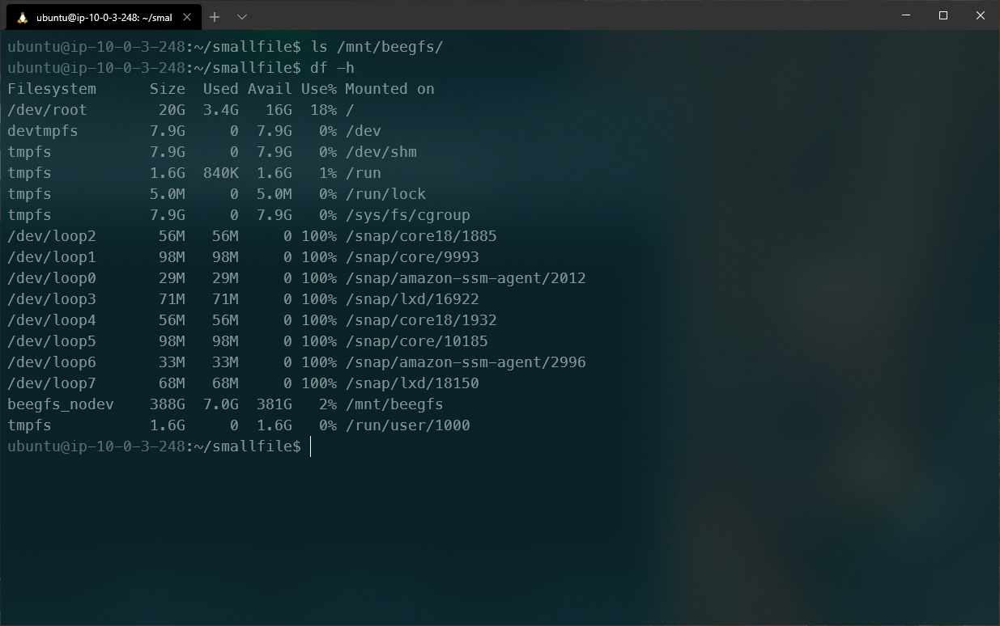
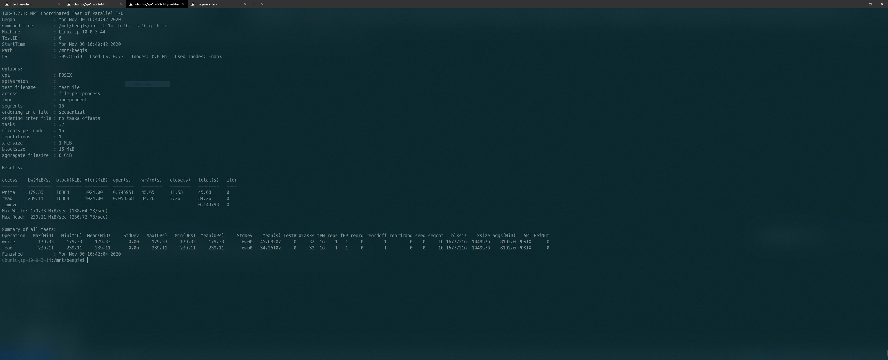

Notizen:
DFS: *beegfs*
Benchmarking: *IOR* u. StorageBench

Ausprobiert:
bonnie++
izone

Architektur:
1 Managment
2 Storage
1 Metadata
2 Client

Disks auf einem Storage:

Erster Versuch: Eine Disk pro Storage Node

Nach langem tüfteln und noch immer Ausbaubedürftig: 2 I/O Optimierte Disks pro Storage Node

sources:

https://github.com/distributed-system-analysis/smallfile

https://www.beegfs.io/wiki/Benchmark

https://ior.readthedocs.io/en/latest/userDoc/tutorial.html