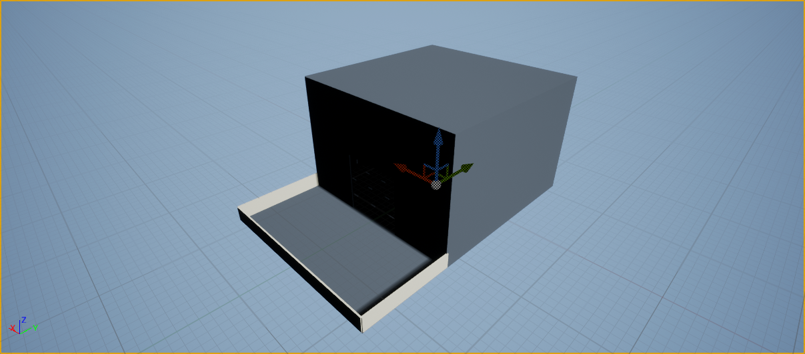
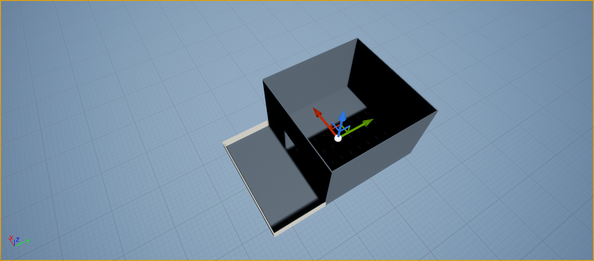
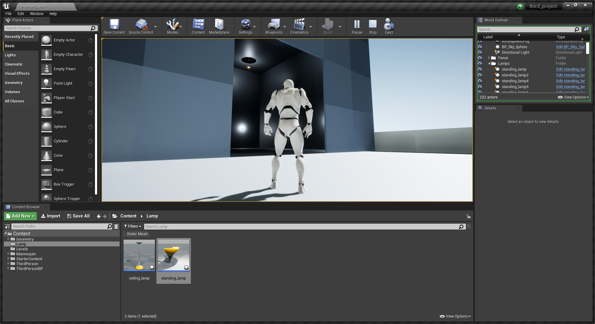
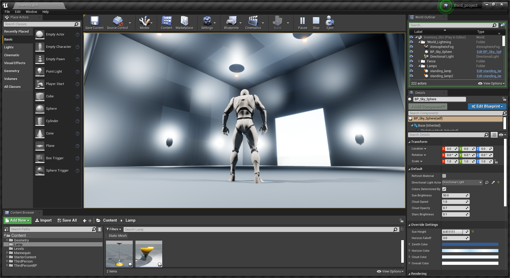

Übung macht den Meister. Practice Practice Practice. Angst sollte man nicht vor denjeninge haben der einmal 1000 Kicks geübt hat, sonder vor dem, der einen Kick 1000 mal geübt hat. Wer oft schießt...trifft das Ziel.
Ok, langsam wirds komisch. Aber so eine kleine Routine, um Muscle Memory für Shortcuts und sich oft wiederholende Workflows aufzubauen ist definitiv nicht schlecht. Ausbauen lässt sich sowas allemal, aber wir sind ja noch Anfänger.

Daher hier meine Routine mit "hübschen" Bildern.

Daily Routine:

* Erstelle ein neues Projekt ( ich nehm 3rd Person / TopDown als Template)
* Erstelle ein Level Ordner in Content
* Erstelle ein neues Level, damit wir von komplett 0 Anfangen müssen, aber den StarterContent etc. haben.
* Plaziere 3 Lichtobjekte
    * Directional Light
    * BP\_Sky\_Sphere
    * AtmosphericFog
* Sag der Sky\_Sphere, dass sie sich auf Directional Light beziehen soll
* Baue eine Plattform, damit man drauf laufen kann
* Baue ein Häuschen
* Erstelle eine neue Blueprint Klasse "Lampe"
    * Bearbeite die Klasse
    * Ziehe ein Static Mesh rein, was einem gegestand ähnelt, der Beleuchtung ausstrahlt. Lampen z.B.
    * Setze ein Point Light auf eine passende Stelle.
    * Compilieren und Speichern.
* Beleuchte das Haus.

Shortcuts:

F9: Screenshot aufnehmen
CTRL-W: Duplizieren