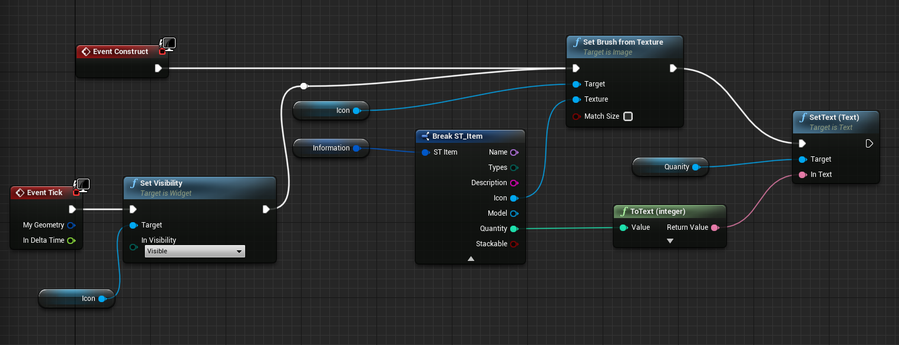
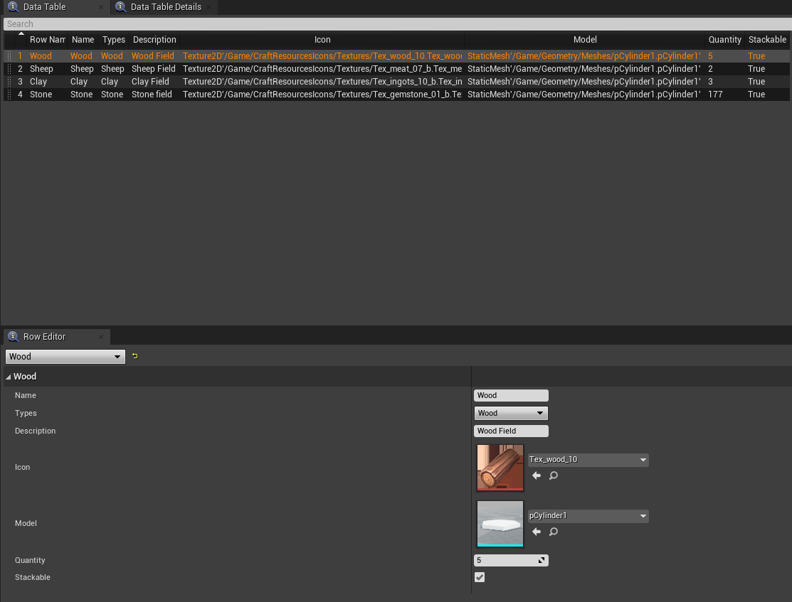
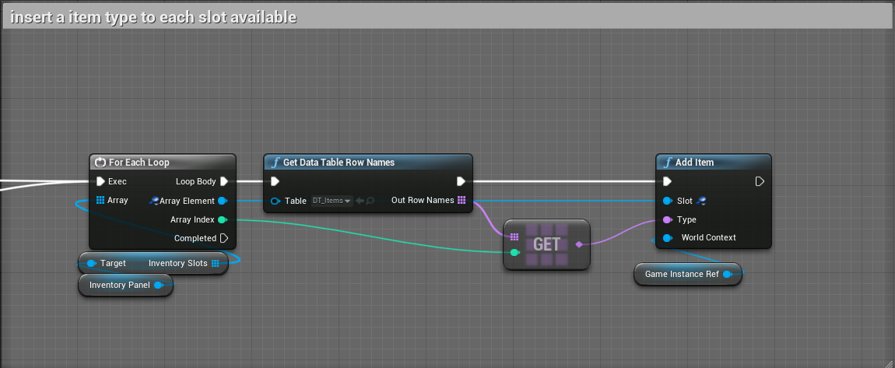
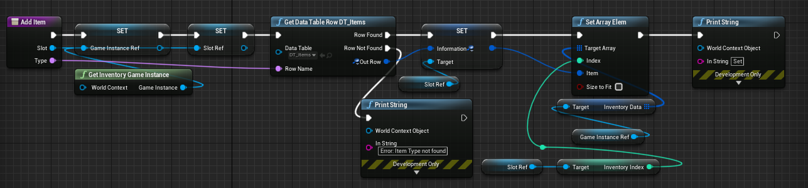
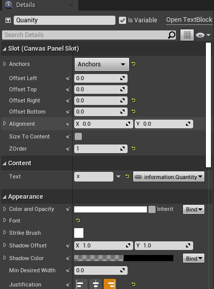
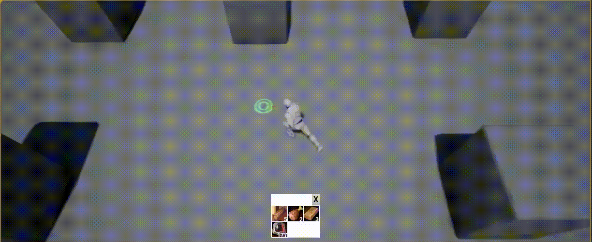

So heute geschafft am Inventory System weiter zu kommen. Zuerst einmal auf welchem Stand ich war. Das Inventar wurde vom Layout richtig angezeigt.
Mit dem Spaghetti Code von gestern konnte die Quantität aus dynamisch zugewiesen werden. Dabei habe ich dem letzten WG_Inventory_Slot Informationen über ein ST_Items aus der DT_items Datentabelle gegeben. Zu dem Zeitpunkt habe ich noch die Textkomponente zu Fuß mit Blueprint zugewiesen (Hab festgestellt, dass es schlauer geht =] ). Allerdings wollte er das Icon nicht setzten, obwohl ich die Information auf die gleiche Weise gesetzt habe, wie die Textkomponente. Nach vielen Rumprobieren, z.B. die Visibility des Icons per Buttonclick setzen, SlateBrush erstellen und auf verrückte Arten casten, etc. habe ich versucht mit dem guten alten Debugger ranzugehen und Variablen zu untersuchen. Der Debugger und Devtools an sich ist wieder ein Monstrum für sich. Wenigstens konnte ich durch *Breakpoints* und Variablen *Watching* interessante Einsicht erlangen. Festgestellt wurde, dass das Icon vom Typ Image Object Reference definitv im WG_Inventory_Slot gesetzt wurde. 

**Warum also will kein Icon dargestellt werden?**

Der Anhaltspunkt mit der Visibility des Icons war schon gut. Allerdings hat das Setzen des SlateBrush nichts gebracht. Zu dem Zeitpunkt habe ich von Events in Blueprints gelernt ( Rote Kästen). Da findet man unter anderem die Events *Event Construct* und *Event Tick*. Beim Erstellen eines Slots wird anhand seiner Variable *information*, die ein *ST_Item* Struct ist, die Image Object Reference Icon mittels *Set Brush from Texture* und Feld *Icon* von *information* gesetzt. Bei der Gelegenheit wurde auch direkt die Quantität als Text gesetzt. 

So genau weiß ich noch nicht wie das Event *Event Tick* intern funktioniert. Allerdings wird das ab einem gewissen Punkt dauerhaft gefeuert. Das habe ich dazu genutzt sicherzustellen, dass die Visibility des Slots auf Visible gesetzt ist und das das Icon, sowie die Quantität aufgefrischt wird. 

**Blueprint Construct und Tick Event WG_Inventory_Slot**

Da ich das ganze etwas dynamischer haben wollte und eventuell mehr als 3 Slots verfügbar sein werden, habe ich mir gedanken und die Funktion *Add Item* gemacht. Auch das verbinden der Data Table mit den Inventory Slots musste implementiert werden. 

Zuerst also einen weiteren Datensatz in die DataTable eintragen.
**DT_Items mit 4 Datensätzen**

Anschließend die Funktion *initialize Inventory* erweitert. Für jeden angelegten Inventory Slot wird ein Datensatz Identifikator aus der DataTable DT_Items gezogen. Sowohl der Identifikator vom Typ Name, als auch der aktuelle WG_Inventory_Slot werden der Funktion Add Item als Übergabeparameter mitgegeben.

**Erweiterung der initialize Inventory Funktion** 

Die Add Item Funktion setzt grundlegend die Variable *Information* des WG_Inventory_Slots und teilt das der Welt mit, indem das ST_Item der Inventory Data des Game Instance Referenz gesetzt wird, welches durch den Index des WG_Inventory_Slots ermittelt wird. Der Gedanke dabei ist, dass das Inventar auch über eine Levelwechsel hinaus erhalten bleibt, da die Game Instanz die Daten mitnimmt.

**Implementierung der Add Item Funktion**

Zu guter Letzt habe ich entdeckt, dass man Darstellungen an Variablen **binden** kann. Damit wird einem die Möglichkeit gegeben, dynamisch Variablen von Komponenten, wie z.B. Icons und Quantität, zu setzten. Durch das Tick Event werden diese Variablen bei Änderungen (hoffentlich) neu gesetzt.

**Binden von Variablen an Komponenten**

Das Ergebnis ist folgendermaßen. Die Coolen Icons, die ich mir aus dem Marketplace runtergeladen habe, kommen endlich zum Einsatz. Die Icons sind durch den darunterliegenden Button auch anklickbar. Das ist durch die Ausgegebenen String Links Oben ersichtlich.

Leider sind zu diesem Zeitpunk keine weiterführenden Youtube Videos mehr von Garrett Fredley da gewesen, weshalb der in diesem Post gezeigte Teil selbst gemacht werden musste. Das macht das Ganze natürlich etwas langwieriger. Aber der Umgang mit Blueprint, der UE, dem Debugger etc. ist dadurch definitv sicherer geworden. =D
