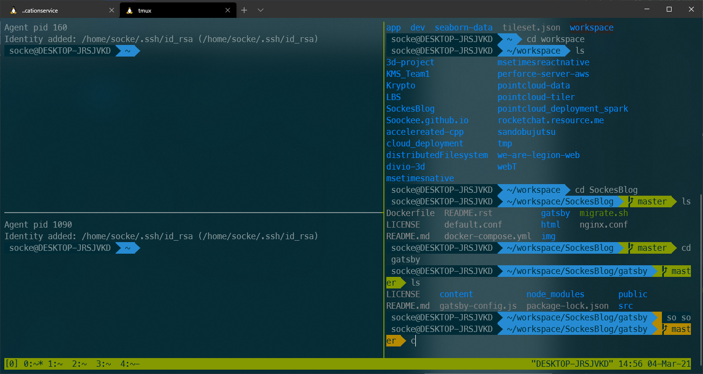
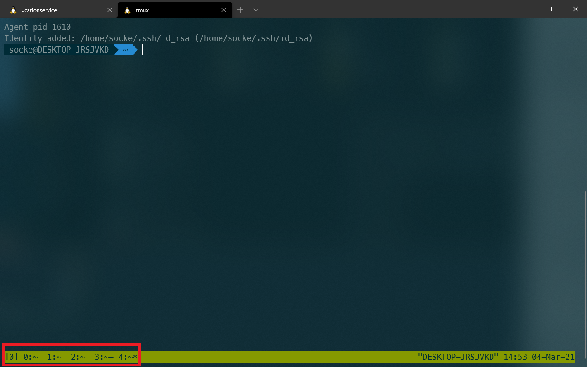

Eine kleine Sammlung von tmux commands innerhalb und ausserhalb einer Session. 
Geplant ist noch die Dokumentation einer tmux.conf. Dafür brauch man aber erstmal das Gefühl von der Notwendigkeit von Customizations :)

## Commands

| Prefix 	|                           Command                          	| Description                                                                                                              	|
|:------:	|:----------------------------------------------------------:	|--------------------------------------------------------------------------------------------------------------------------	|
| ctrl-b 	|                              %                             	|                                                  Split Screen Vertically                                                 	|
| ctrl-b 	|                              "                             	|                                                 Split Screen Horizontally                                                	|
| ctrl-b 	|                         <arrow key>                        	|                                         Navigate to pane in <Arrow Key> direction                                        	|
|        	|                       ctrl-d or exit                       	|                                      The usual command for closing terminal sessions                                     	|
| ctrl-b 	|                              c                             	|                                                   *Create* a new window                                                  	|
| ctrl-b 	|                              p                             	|                                                Switch to *previous* window                                               	|
| ctrl-b 	|                              n                             	|                                                  Switch to *next* window                                                 	|
| ctrl-b 	|                          <number>                          	|                                                 Switch to <number> window                                                	|
| ctrl-b 	|                              d                             	|                                                 *Detach* current session                                                 	|
| ctrl-b 	|                              D                             	|                                                         *Detach*                                                         	|
|        	|                          tmux ls                          	|                                               *List* all running sessions                                                	|
|        	|             tmux attach -t <session-identifier>            	| *Attach* the session <session-identifier>.  The session identifier can be either the session number  or the session name 	|
|        	|                 tmux new -s <session name>                 	|            *Create* a new tmux *session* with <session-name>.  The session name can be used as an identifier.            	|
|        	| tmux rename-session -t <session-number> <new session name> 	|                           *Rename* a *session* by given <session-number> to <new session name>                           	|
| ctrl-b    |                              ?                               	|                                               list all available commands                                               	|
| ctrl-b    |                              z                              	|                    make a pane go full screen. Hit C-b z again to shrink it back to its previous size                     |
| ctrl-b    |                              C-<Arraow-key>                   |                                               Resize Pane in <Arrow-Key> direction                                        |
| ctrl-b    |                              ,                              	|                                                         Rename current window                                             |

## Why tmus

* Session handling
* platform independence
* cutomizable
* it's cool

## How does it look, how does it feel?

source: 
* https://www.hamvocke.com/blog/a-quick-and-easy-guide-to-tmux/
* https://www.hamvocke.com/blog/a-guide-to-customizing-your-tmux-conf/